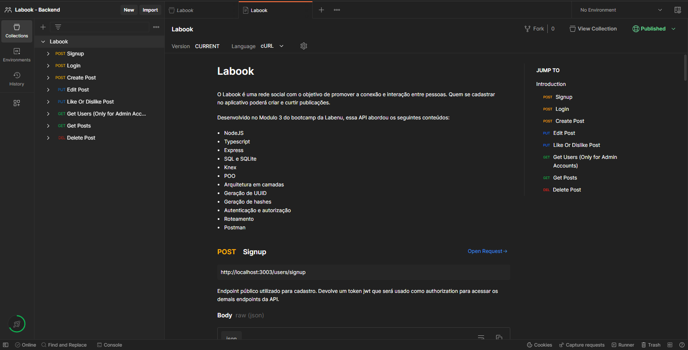

# -Labook - Back-end -

## 📖 Introdução
O Labook é uma rede social com o objetivo de promover a conexão e interação entre pessoas. Quem se cadastrar no aplicativo poderá criar e curtir publicações. 

<br>
<br>
<br>

## 🔗 Link da aplicação
- Labook API - [aqui.](https://documenter.getpostman.com/view/25826560/2s93eX1YwX)

<br>
<br>

## 👨‍💻 Desenvolvido Por:
| [<br><sub>Henrique Batista</sub>](https://github.com/HenriqBatista)|
|:---:|

<br>
<br>
<br>

## 📝 Passos para executar o Projeto em sua máquina:

```bash
# Instalando as dependências
npm install

# Executando o projeto
npm run dev

## Obs: é necessário baixar o Postman em sua máquina para ter uma melhor visualização do funcuionamento da API.
```
<br>
<br>

## 💻 Preview do Projeto
<br><sub>Visualização da API no Postman.<sub><br>

<br>
<br>

## 💻 Funcionalidades

Seguindo o fluxo CRUD, a API possui 8 Endpoints, sendo:
### Create:
- Signup - Sendo referente ao createUser 

- Login - Sendo referente ao createUser com uma 
verificação se o usuário já existe no banco de dados

- Create Post

### Get:
- Get Posts - Pega toda a lista de posts ja criados e salvos no banco de dados, para que o usuário possa pegar o Id do post para excluí-lo ou usar a função Like/Dislike.

- Get Users - Endpoint protegido, onde apenas contas do tipo "ADMIN" podem ter acesso a lista de todos os usuários cadastrados no banco de dados.


### Edit
- Edit Post - Possibilita a edição de um post que ja foi feito anteriormente. Somente o criador do post pode edita-lo.
- Like/Dislike Post - Possibilita dar like ou deslike em alguma post feito por outros usuários.

### Delete
- Delete Post - Faz a deleção do post indicado pelo o seu Id. Somente o usuário que fez o post ou a pessoa Admin poderá deletar.


<br>
<br>
<br>

## 📚 Conteúdos Abordados

````bash
NodeJS
Typescript
Express
SQL e SQLite
Knex
POO
Arquitetura em camadas
Geração de UUID
Geração de hashes
Autenticação e autorização
Roteamento
Postman
````
<br>
<br>
<br>

## 💡Programas utilizados:
- VSCode
- Postman

<br>
<br>
<br>

# 📫 Contatos

📧 E-mail: henriq.batista.veloso@gmail.com

[](https://www.linkedin.com/in/henrique-batista-veloso/)

